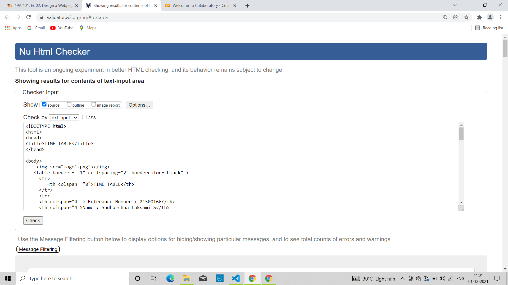

# Experiment_Time_Table

## AIM
To Write a html webpage page to display your timetable.

# ALGORITHM
### STEP 1
create a simple table using table tag
### STEP 2
Add header row using th tag
### STEP 3
Add your timetable
### STEP 4
Execute the program

# CODE
```
<!DOCTYPE html>
<html>
<head>
<title>TIME TABLE</title>
</head>

<body>

   <table border = "1" cellspacing="2" bordercolor="black" >
     <tr>
        <th colspan ="8">TIME TABLE</th>
     </tr>
     <tr>
     <th colspan="4" > Referance Number : 21500166</th>
     <th colspan="4">Name : Sudharshna Lakshmi S</th>
     </tr>
     <tr>
        <th>DAYS</th>
        <th>8:00-9:00</th>
        <th>9:00-10:00</th>
        <th>10:00-11:00</th>
        <th>11:00-12:00</th>
        <th>12:00-1:00</th>
        <th>1:00-2:00</th>
        <th>2:00-3:00</th>
     </tr>
     <tr>
        <th>MONDAY</th>
        <th align="center">19AI401/Obed Otto C</th>
        <th align="center">19AI401/Obed Otto C</th>
        <th align="center">19MA221/Jaba Jashpin E.T</th>
        <th align="center">19MA221/Jaba Jashpin E.T</th>
        <th align="center">ECA051-AD/Sridhar S</th>
        <th align="center">19MA220/Jaba Jashpin E.T</th>
        <th align="center">19MA220/Jaba Jashpin E.T</th>
      </tr>
      
      <tr>
        <th>TUESDAY</th>
        <th align="center">19EY701/Praveen P</th>
        <th align="center">19EY701/Praveen P</th>
        <th align="center">19AI303/Ram G.R</th>
        <th align="center">19AI303/Ram G.R</th>
        <th align="center">--</th>
        <th align="center">19AI302/Ram G.R</th>
        <th align="center">19AI302/Ram G.R</th>
      </tr>
      <tr>
        <th>WEDNESDAY</th>
        <th align="center">--</th>
        <th align="center">--</th>
        <th align="center">19MA220/Jaba Jashpin E.T</th>
        <th align="center">19MA220/Jaba Jashpin E.T</th>
        <th align="center">--</th>
        <th align="center">19AI401/Obed Otto C</th>
        <th align="center">19AI401/Obed Otto C</th>
      </tr>
      <tr>
        <th>THURSDAY</th>
        <th align="center">19AI302/Ram G.R</th>
        <th align="center">19AI302/Ram G.R</th>
        <th align="center">19AI301/Jaba Jashpin E.T</th>
        <th align="center">19AI301/Jaba Jashpin E.T</th>
        <th align="center">--</th>
        <th align="center">19AI303/Ram G.R</th>
        <th align="center">19AI303/Ram G.R</th>
      </tr>
      <tr>
        <th>FRIDAY</th>
        <th align="center">19MC802/Muthupandi</th>
        <th align="center">19MC802/Muthupandi</th>
        <th align="center">19AI301/Jaba Jashpin E.T</th>
        <th align="center">19AI301/Jaba Jashpin E.T</th>
        <th align="center">--</th>
        <th align="center">19AI402/Obed Otto C</th>
        <th align="center">19AI402/Obed Otto C</th>
       </tr>
</body>
</html>
```

# OUTPUT:
## Server side output:


## Client side Output:


## Validator:



# RESULT:
   A html webpage is successfully created to display the timetable.
